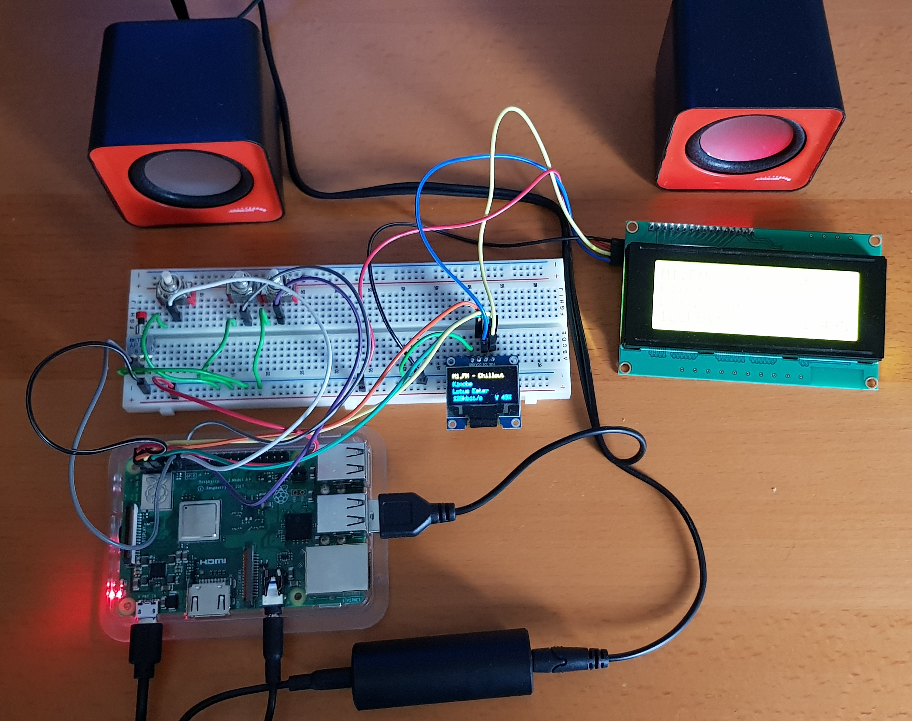
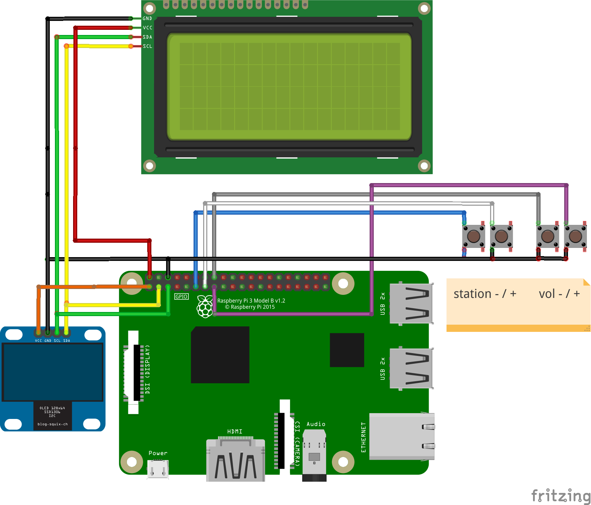
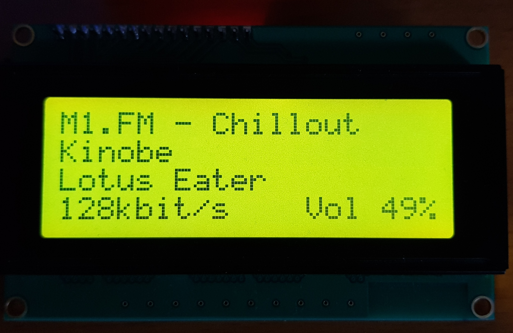
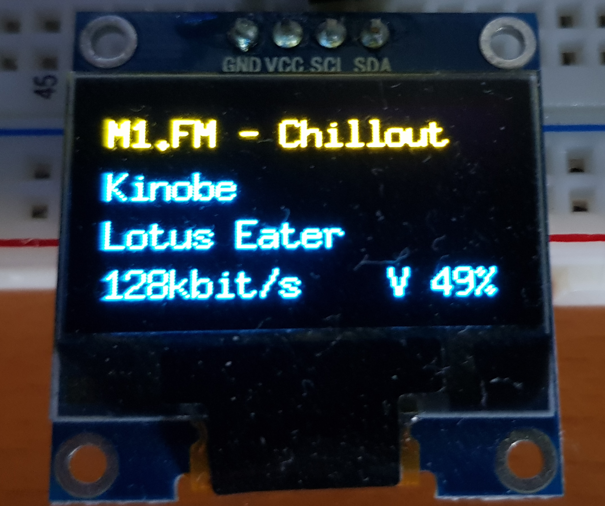

## Internet radio player for the Raspberry PI written in GO
This project describes what is neccessary to build an internet radio player with GO for the Raspberry Pi.
There is a [documentation file](doc/development.md) about some aspects of the software design 
(i.e. *why do you use an extra channel for the display?*). 

The wiring is also documented with a fritzing sketch.

### Hardware
For the development I'm using a model 3B+ but the final target will be a Raspberry PI Zero WH. 
This is the cheapest model that has WIFI. An internet radio without WIFI doesn't makes sense
in my opinion.

The documentation about that version can be found [here](doc/raspi_zero.md).

#### Displays
As display you can choose between two differnt types: a 20x4 LCD or a 0,96" OLED both with i²c interface. The program
can handle both of them but not simultaneously. There's a flag to switch between LCD and OLED (hint try `piradio -help`).

#### Speaker
It's up to you what you use as loudspeakers. I'm using a pair of cheap usb speakers. It's absolutely neccessary to
have a galvanic isolation between the loudspeaker input and the raspberry pi. Otherwise you will hear any possible
interferences in the speakers. I bought the noise filter (ground loop isolator, the black round tube at the bottom of
the photo) from a big american online warehouse.

It's also possible to connect a Bluetooth speaker to the raspberry pi, but that
is documented in the [readme of the Raspi Zero W](doc/raspi_zero.md).

### Software
The software is written in GO (1.14) and it uses the `mplayer` for the heavy lifting part (music streaming etc.).
There are currently 4 (self describing)  buttons:

- next station
- previous station
- increase volume
- decrease volume
- mute/unmute

The list of stations is loaded at the start from the location `~/.piradio/stations`. If this file doesn't exist or is 
empty, a default list with 3 stations is created. This part was inspired by the 
[goradio](https://github.com/jcheng8/goradio) project.

The last played station will be remembered. The actual list index is stored in
`~/.piradio/last_station`. On the next start, the last used station index is loaded. When a station
change is made, the actual index is delayed written to the file (see `debounceWrite`).

The software will always use a 4 line layout on both displays. The LCD can show 20 characters per line and the OLED
is able to show 18,5 characters.
The first line shows always the station name. The second line will display the artist and the title is in the third line.
These two lines automatically scroll in case of long strings. The scroll speed is configurable via flag
`-scrollSpeed`. It's also possible to scroll the station name, but that has to be enabled via flag `-scrollStation`.

The fourth line shows the stream bitrate and the volume level. When the station is changed, the current time and date is
displayed while the next station is loaded. When the first station in the list is selected, the ip address is displayed
instead.

### Preparation of the Raspberry PI
The following paragraphs imply that your raspberry pi is already configured with raspbian and set up in a way that
you can ping him (at 10.7.7.43 in my case) from another pc.

#### enable ssh for login
In file `/etc/ssh/sshd_config` on the raspberry pi change/add the line

    PermitRootLogin yes

Save the file (you probably should use `sudo` for this). After that execute the next two lines

    sudo systemctl start ssh
    sudo systemctl enable ssh

Then execute on the pc 

    ssh-copy-id -i ~/.ssh/id_rsa.pub pi@10.7.7.43
     
This will ensure that you don't need a password for connecting.

On the raspberry pi enter

    sudo passwd
    
to set a new password for user **root**. After that, enter the following line on the pc:

    ssh-copy-id -i ~/.ssh/id_rsa.pub root@10.7.7.43
    
This way, you also don't need a password when connecting as user root.

#### Enable i²c
Start program `sudo raspi-config` and select menu `5 Interfacing Options` and there the sub menu
`P5 i²c` via cursors and press ENTER. Move to `<YES>` via cursor keys and press ENTER again.

Restart now the raspberry via `sudo reboot`.
Login and test via tool `i2cdetect` the i²c bus:

    sudo i2cdetect -y 1     # or ...-y 0
    
This is the output when both displays are connected (LCD is at 27 and OLED is at 3c):

         0  1  2  3  4  5  6  7  8  9  a  b  c  d  e  f
    00:          -- -- -- -- -- -- -- -- -- -- -- -- -- 
    10: -- -- -- -- -- -- -- -- -- -- -- -- -- -- -- -- 
    20: -- -- -- -- -- -- -- 27 -- -- -- -- -- -- -- -- 
    30: -- -- -- -- -- -- -- -- -- -- -- -- 3c -- -- -- 
    40: -- -- -- -- -- -- -- -- -- -- -- -- -- -- -- -- 
    50: -- -- -- -- -- -- -- -- -- -- -- -- -- -- -- -- 
    60: -- -- -- -- -- -- -- -- -- -- -- -- -- -- -- -- 
    70: -- -- -- -- -- -- -- --                         

In case the tool is not installed:

    sudo apt update && sudo apt install i2c-tools

#### Start binary with parameters
Piradio comes with several command line parameters. When no parameters are given, the LCD will be used.
All parameters are case sensitive.

    cd /home/pi
    ./piradio           # uses the LCD
    ./piradio -oled     # uses the OLED
    ./piradio -help     # shows all options
    Usage of ./piradio:
      -backlightOff
        	set to switch off backlight after some time
      -backlightOffTime int
        	backlight switch off time in s (3s...3600s) (default 15)
      -camelCase
        	set to format title
      -debug
        	set to output mplayer info on stdout
      -lcdDelay int
        	initial delay for LCD in s (1s...10s) (default 3)
      -noBluetooth
        	set to only use analog output
      -noise
            set to remove noise from title
      -oled
        	set to use OLED Display
      -scrollSpeed int
        	scroll speed in ms (100ms...10000ms) (default 500)
      -scrollStation
        	set to scroll station names

Description of the options:
- backlightOff: if set and if using the LCD, the backlight will be switched off after NN seconds, when no button 
is pressed during this time.
- backlightOffTime: the time in seconds the backlight is on. Will be reset with every button press.  
- camelCase: if set, the Title will be formatted in a *camel case* way
- debug: in case of problems set this option a see what happens on the comand line. `piradio` has to 
be started manually in the shell to see the output.
- lcdDelay: sometimes the LCD will not be correctly initialized and the display shows funny characters.
In this case increase this value. Only needed for the LCD.
- noBluetooth: when set, no bluetooth connection will be tried. 
- noise: some stations transmit very long title names with the remix name in round brackets. If you 
enable this option these strings will be removed and the title will most probably fit on the display without 
scrolling.
- oled: set this option to use the OLED display.
- scrollSpeed: the scrolling is set by default to a speed of 500ms. If this speed is too fast or too 
slow for you, please set a different value here.
- scrollStation: if you want the station name to scroll in case of long names, please enable 
this option.

Various options set:

    ./piradio -oled -camelCase -scrollStation -scrollSpeed=300
    ./piradio -camelCase=false -debug=false -scrollSpeed=300 -scrollStation=false -oled=true 
    ./piradio -camelCase=false -debug=false -scrollSpeed=750 -scrollStation=false -lcdDelay=5 -noise=true 

### Start piradio on boot
#### Start
In order to start piradio on every boot, we have to add a line in `/etc/rc.local`:

     su pi -c '/home/pi/piradio -oled -scrollSpeed=300 &'

Please put this line **before** the line containing `exit 0`!

This will start `piradio` as a background task of user `pi`. The user switch is needed because otherwise
`piradio` would run with `root` priviliges.

The parameter used are just one possibility to start `piradio` and can also be omitted. It's important
to end the line with an `&` and that the user has the right to start `piradio` in that folder.
The file `rc.local` needs admin rights to be changed:

    sudo nano /etc/rc.local

#### Stop
If you need to stop the automatically started `piradio`, please proceed as follows. First, get the
`Process Group ID (PGID)` of piradio and the mplayer processes:

    ps -o pgid,cmd -U pi
    
    PGID  CMD
     561  /lib/systemd/systemd --user
     561  (sd-pam)
     570  /home/pi/piradio -oled -scrollSpeed=300
     570  mplayer -quiet http://tuner.m1.fm/chillout.mp3
     570  mplayer -quiet http://tuner.m1.fm/chillout.mp3
     981  sshd: pi@pts/0
     993  -bash
    1044  ps -o pid,ppid,pgid,cmd -U pi
    
The line containing `/home/pi/piradio ...` has a number (570) in column `PGID`. This PGID number is also
shown in the lines containing `mplayer ...`. To stop all these processes in one go, enter the following:

    kill -- -570

Now you can copy your fresh version of `piradio` to your Raspberry Pi.

### See title/interpret in terminal
If you want to see the actual title/interpret in a remote terminal, you should
run the following command to see the log of piradio:

    less ~/.piradio/log/piradio.pi.INFO
    
Press `<shift>+<f>` to let less update the log constantly.
