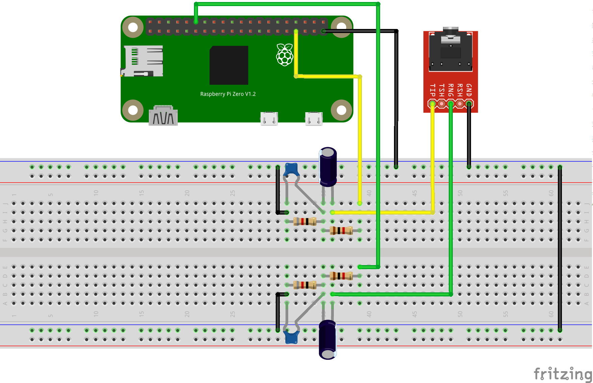

## Preparing the Raspberry Zero W

### Create Micro-SD card
Download the Raspbian Buster Lite image from [this site](https://www.raspberrypi.org/downloads/raspbian/).
Unzip the downloaded file and insert an empty sd card into the card reader.
Check which device is responsible for this card:

    lsblk -p
    
This will give a list with a lot of devices. In my case, the last line showed

    /dev/sdc      8:32   1   3,7G  0 disk

This is the 4GB sd card I'm using. Now enter the following command to copy the image 
to the sd card:

    sudo dd bs=4M if=2019-09-26-raspbian-buster-lite.img of=/dev/sdc status=progress conv=fsync
    
This will take some time. In my case it took 226 seconds. Run `sync` in order to flush
all cached data to the sd card.

### First Boot
Insert the sd card in the sd card slot of the zero w. Connect a display and a keyboard
via the HDMI mini and USB micro connectors and connect the power via the second (right most) 
micro USB connector.

When the login prompt appears, login as user *pi* with password *raspberry* (please mind the English 
keyboard layout).

Run `raspi-config` and select the correct locale, timezone, keyboard layout and wifi country from
menu **4** (Localisation Options). When entering the locale, please select all locales for your country: for German this 
is `de_DE, de_DE.UTF-8 and de_DE@euro`. In menu **2** (Network Options) enter a name for your raspberry.

In order to **not** store the wifi passwords in a human readable way, please proceed as follows
for all wifi networks:

    wpa_passphrase SSID-OF-WIFI SECRET-PASSWORD >> /etc/wpa_supplicant/wpa_supplicant.conf

This tool will add the network settings of the wifi at the end of the given file. Please run

     sudo nano /etc/wpa_supplicant/wpa_supplicant.conf
     
and check the generated part. Remove the commented lines with the unencrypted passwords.

Reboot, login again and try to ping your router.

### Enabling ssh connections and i2c 
Run `raspi-config` and enable *ssh* and *i2c* from menu **5** (Interfacing Options).

Now you can access your Zero W from other computer via `ssh pi@10.7.7.39` i.e. If you want to connect
without entering a password, you have to give your public ssh key to the raspi:

     ssh-copy-id pi@10.7.7.39
     
After done that, you can ssh into your raspi without entering a password.

### Install mplayer
Run `sudo apt update && sudo apt install mplayer`.

#### Enable i²c
Start program `sudo raspi-config` and select menu `5 Interfacing Options` and there the sub menu
`P5 i²c` via cursors and press ENTER. Move to `<YES>` via cursor keys and press ENTER again.

Restart now the raspberry via `sudo reboot`.
Login and test via tool `i2cdetect` the i²c bus:

    sudo i2cdetect -y 1     # or ...-y 0
    
This is the output when both displays are connected (LCD is at 27 and OLED is at 3c):

         0  1  2  3  4  5  6  7  8  9  a  b  c  d  e  f
    00:          -- -- -- -- -- -- -- -- -- -- -- -- -- 
    10: -- -- -- -- -- -- -- -- -- -- -- -- -- -- -- -- 
    20: -- -- -- -- -- -- -- 27 -- -- -- -- -- -- -- -- 
    30: -- -- -- -- -- -- -- -- -- -- -- -- 3c -- -- -- 
    40: -- -- -- -- -- -- -- -- -- -- -- -- -- -- -- -- 
    50: -- -- -- -- -- -- -- -- -- -- -- -- -- -- -- -- 
    60: -- -- -- -- -- -- -- -- -- -- -- -- -- -- -- -- 
    70: -- -- -- -- -- -- -- --                         

In case the tool is not installed:

    sudo apt update && sudo apt install i2c-tools

### Updating all packages
Run `sudo apt update && sudo apt upgrade` and wait until all updates are installed.

### audio output
Since the Raspberry Zero dowsn't have an audio jack, we need to route the internal
PWM signals to GPIO pins and shape the signal so that they are compatible with standard
audio equipment. The routing is done with an entry in `/boot/config.txt`. Just put the 
following line at the end of the file:

    dtoverlay=pwm-2chan,pin=18,func=2,pin2=13,func2=4

You need su rights to change the file. After changing, please reboot.

#### signal shaping
The shaping is a simple RC lowpass filter together with an output condensator to eliminate
dc from the signal. Since the pwm output have a quite high voltage, a voltage divider is
in front of the filter. The calculation for the RC filter was done on [this page](https://electronicbase.net/de/tiefpass-berechnen/#passiver-tiefpass-1-ordnung).
The Fritzing schematic is located in [this file](https://github.com/aluedtke7/piradio/blob/master/doc/RaspiZero.fzz).

